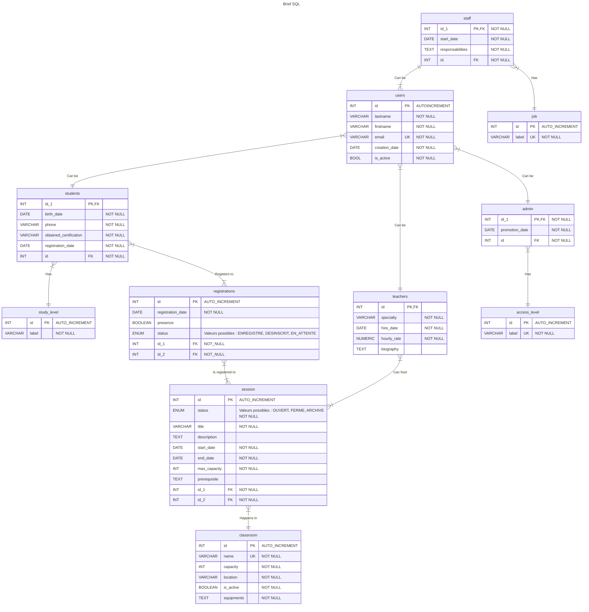

```mermaid
---
title: Brief SQL
---
erDiagram
	direction TB
	access_level {
		INT id PK "AUTO_INCREMENT"  
		VARCHAR label UK "NOT NULL"  
	}

	users {
		INT id PK "AUTOINCREMENT"  
		VARCHAR lastname  "NOT NULL"  
		VARCHAR firstname  "NOT NULL"  
		VARCHAR email UK "NOT NULL"  
		DATE creation_date  "NOT NULL"  
		BOOL is_active  "NOT NULL"  
	}

	study_level {
		INT id PK "AUTO_INCREMENT"  
		VARCHAR label  "NOT NULL"  
	}

	students {
		INT id_1 PK,FK ""  
		DATE birth_date  "NOT NULL"  
		VARCHAR phone  "NOT NULL"  
		VARCHAR obtained_certification  "NOT NULL"  
		DATE registration_date  "NOT NULL"  
		INT id FK "NOT NULL"  
	}

	classroom {
		INT id PK "AUTO_INCREMENT"  
		VARCHAR name UK "NOT NULL"  
		INT capacity  "NOT NULL"  
		VARCHAR location  "NOT NULL"  
		BOOLEAN is_active  "NOT NULL"  
		TEXT equipments  "NOT NULL"  
	}

	job {
		INT id PK "AUTO_INCREMENT"  
		VARCHAR label UK "NOT NULL"  
	}

	registrations {
		INT id PK "AUTO_INCREMENT"  
		DATE registration_date  "NOT NULL"  
		BOOLEAN presence  ""  
		ENUM status  "Valeurs possibles : ENREGISTRE, DESINSCRIT, EN_ATTENTE"  
		INT id_1 FK "NOT_NULL"  
		INT id_2 FK "NOT_NULL"  
	}

	session {
		INT id PK "AUTO_INCREMENT"  
		ENUM status  "Valeurs possibles : OUVERT, FERME, ARCHIVE

NOT NULL"  
		VARCHAR title  "NOT NULL"  
		TEXT description  ""  
		DATE start_date  "NOT NULL"  
		DATE end_date  "NOT NULL"  
		INT max_capacity  "NOT NULL"  
		TEXT prerequisite  ""  
		INT id_1 FK "NOT NULL"  
		INT id_2 FK "NOT NULL"  
	}

	admin {
		INT id_1 PK,FK "NOT NULL"  
		DATE promotion_date  "NOT NULL"  
		INT id FK "NOT NULL"  
	}

	staff {
		INT id_1 PK,FK "NOT NULL"  
		DATE start_date  "NOT NULL"  
		TEXT responsabilities  "NOT NULL"  
		INT id FK "NOT NULL"  
	}

	teachers {
		INT id PK,FK ""  
		VARCHAR specialty  "NOT NULL"  
		DATE hire_date  "NOT NULL"  
		NUMERIC hourly_rate  "NOT NULL"  
		TEXT biography  ""  
	}

	users}|--||students:"Can be"
	students}|--||study_level:"Has"
	users}|--||teachers:"Can be"
	teachers}|--|{session:"Can host"
	staff||--|{users:"Can be"
	users}|--||admin:"Can be"
	admin}|--||access_level:"Has"
	staff}|--||job:"Has"
	registrations}|--|{session:"Is registered to"
	session}|--||classroom:"Happens in"
	students}|--|{registrations:"Registers to"
```